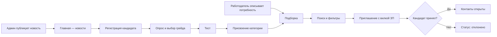

# Минимальный набор экранов по ТЗ

> Платформа-агрегатор ИТ-вакансий с верифицированным профилем достижений
> участника ФСП.

**Обозначения ссылок на ТЗ:**

| Обозначение | Раздел ТЗ |
|---|---|
| **п.2** | Описание задачи |
| **2.1** | Функциональные требования |
| **2.2** | Данные и правила видимости |
| **3.3** | Требования к демонстрации |
| **3.5** | Нефункциональные требования |
| **п.6** | Критерии оценки |

## Содержание

1. [Общие экраны](#общие-экраны)
2. [Кабинет «Кандидат»](#кабинет-кандидат)
3. [Кабинет «Работодатель»](#кабинет-работодатель)
4. [Кабинет «Администратор»](#кабинет-администратор)
5. [Необязательные экраны](#необязательные-экраны)
6. [Сквозной сценарий для демо](#сквозной-сценарий-для-демо)
7. [Сводная таблица](#сводная-таблица)

---

## Общие экраны

### 1. Регистрация / вход

| Элемент | Зачем | Где в ТЗ |
|---|---|---|
| Email + пароль | Регистрация только по почте | 2.2, п.4 |
| Выбор роли (кандидат / работодатель) | Два раздельных кабинета | 2.1 |
| Чекбокс согласия на обработку данных | 152-ФЗ | 3.5; 2.1 |

### 2. Подтверждение email

| Элемент | Зачем | Где в ТЗ |
|---|---|---|
| Ввод кода | Регистрация с подтверждением адреса | 2.2, п.4 |

### 3. Главная (лента новостей)

| Элемент | Зачем | Где в ТЗ |
|---|---|---|
| Публичный список новостей платформы | Общая точка входа для всех ролей | — |
| Пустое состояние «Пусто, ожидайте новостей» | Обработка случая, когда новостей нет | — |
| Точка входа в кабинет через навбар | Роль определяет дальнейшую навигацию | 2.1 |

Клик по логотипу ведёт на главную. Пункт «Главная» — первый слева в
навбаре у всех трёх ролей.

---

## Кабинет «Кандидат»

### 4. Профиль / резюме

| Элемент | Зачем | Где в ТЗ |
|---|---|---|
| ФИО, контакты, стек, грейд, роли, стаж, софт-скиллы | Состав полей профиля | 2.1 |
| Кнопка «Скачать PDF-профиль» | Автогенерация PDF | 2.1 |
| Загрузка PDF с автораспознаванием | На оценку не влияет | 2.1 |
| Подпись «не влияет на категорию» | Категория определяется тестом | п.2; 2.1 |

### 5. Опрос: отрасль, специализация, грейд

| Элемент | Зачем | Где в ТЗ |
|---|---|---|
| Выбор отрасли и специализации | Обязательный путь при регистрации | п.2 |
| Самостоятельный выбор грейда | Определяет уровень теста | п.2 |
| Справочник из основных направлений | На MVP достаточно | п.2 |

Переход: опрос → тест. Кнопка «Тестирование» в навбаре ведёт на
`/survey.html`.

### 6. Экран тестирования

| Элемент | Зачем | Где в ТЗ |
|---|---|---|
| Задания, таймер, поле ответа, кнопка «Завершить» | Механика тестирования | п.2 |
| Задания из пула, не единый набор | Устойчивость к распространению | п.2; п.6.2 |
| Разные варианты у разных кандидатов | Нужно показать в демо | 3.3 |

### 7. Результат теста и присвоенная категория

| Элемент | Зачем | Где в ТЗ |
|---|---|---|
| Итог и категория вида «Backend, Middle» | Категория видна работодателю | 2.1 |
| Краткое объяснение результата | Прозрачность оценки | п.6.2 |
| Предложение теста уровнем ниже | Грейд не понижается принудительно | п.2 |

### 8. Категория и грейд (статус)

| Элемент | Зачем | Где в ТЗ |
|---|---|---|
| Текущие специализация и грейд | Текущий статус | 2.1 |
| История опроса и тестов | То же | 2.1 |
| Кнопки «Тест выше / ниже» | Повышение и понижение | п.2; 2.1 |
| Блокировка с датой доступности | Лимит раз в 3 месяца | п.2; 2.1 |

### 9. Входящие приглашения (список + деталь)

| Элемент | Зачем | Где в ТЗ |
|---|---|---|
| Список со статусами | Статусная модель | 2.2, п.3 |
| Компания, описание, способ связи | Содержимое приглашения | 2.2, п.2 |
| Вилка зарплаты «от–до» в рублях | Условия до начала общения | 2.2, п.1 |
| Кнопки «Принять» / «Отклонить» | Действия кандидата | 2.1 |
| Открытие детали → «просмотрено» | Статусы | 2.2, п.3 |

### 10. Настройки

| Элемент | Зачем | Где в ТЗ |
|---|---|---|
| Переключатели приватности | Управление видимостью | 2.1 |
| Согласия на обработку и публикацию | Требование безопасности | 2.1; 3.5 |
| Блок «Связать с ФСП ID» | Возможность связи с ID | п.2 |
| Состояние «ФСП не привязан» с нейтральным текстом | Обязательный кейс | п.2; п.6.5 |

---

## Кабинет «Работодатель»

### 11. Профиль компании

| Элемент | Зачем | Где в ТЗ |
|---|---|---|
| Описание, направление, контакты | Содержимое профиля | 2.1 |
| Название и способ связи | Подставляются в приглашение | 2.2, п.2 |

### 12. Описание потребности

| Элемент | Зачем | Где в ТЗ |
|---|---|---|
| Какие специалисты нужны, чем занимается команда | Входные данные | 2.1 |
| Стек, специализация, грейд | Основа подборки | 2.1 |

### 13. Подборка (рекомендации)

| Элемент | Зачем | Где в ТЗ |
|---|---|---|
| Рекомендованные категории и кандидаты | Работа с подборкой | 2.1 |
| Строка «Почему в подборке» | Объяснимость выдачи | 2.1; п.6.1 |
| Порядок: тест, затем ФСП | Ранжирование | 2.1 |

### 14. Банк кандидатов (поиск)

| Элемент | Зачем | Где в ТЗ |
|---|---|---|
| Фильтры: специализация, грейд, категория, стек, ФСП | Пять фильтров | 2.1 |
| Уточнение без сброса подборки | Требование к поиску | 2.1 |
| Выдача по категориям, не по тексту | Основа механики | 2.1 |

### 15. Карточка кандидата

| Элемент | Зачем | Где в ТЗ |
|---|---|---|
| Категория, тест, стек | Подтверждённый профиль | 2.1 |
| Блок ФСП с заглушкой | Обязательная обработка | п.2; п.6.5 |
| Кнопка «Пригласить» | К главному сценарию | 2.1 |
| Контактов нет, анонимный ID | Скрыты до принятия | 2.1; 2.2, п.2 |
| Скрытые поля не отображаются | Приватность | 2.1 |

### 16. Форма приглашения

| Элемент | Зачем | Где в ТЗ |
|---|---|---|
| Описание предложения | Содержимое приглашения | 2.2, п.2 |
| Зарплата «от» и «до», в ₽ | Обязательное условие | 2.2, п.1 |
| Название компании и способ связи | Содержимое приглашения | 2.2, п.2 |
| Необязательное поле «Вакансия» | Без привязки к вакансии | 2.1 |

### 17. Мои приглашения (статусы)

| Элемент | Зачем | Где в ТЗ |
|---|---|---|
| Таблица: кандидат, дата, вилка, статус | Отслеживание | 2.1; 2.2, п.3 |
| Контакты открываются после «принято» | Правило видимости | 2.2, п.2; 2.1 |

---

## Кабинет «Администратор»

Админ — третий тип пользователя (наравне с кандидатом и работодателем).
Собственный интерфейс, отдельная панель навигации.

### 18. Админ-панель (встроена в `main.html`)

| Элемент | Зачем |
|---|---|
| Плашка «ADMIN · Режим администратора» | Визуальное отличие интерфейса |
| Форма «Опубликовать новость» | Создание новости |
| Кнопка «Удалить» под каждой новостью | Модерация контента |
| Блок «Соискатели» со списком и кнопками удаления | Управление анкетами |
| Блок «Работодатели» со списком и кнопками удаления | Управление анкетами |

**Навигация:** только пункт «Главная». Ни «Профиля», ни «Тестирования»,
ни других разделов — у админа их нет.

**Регистрация:** админ не регистрируется. Единственный пользователь
`admin@ad.min` / `1` заводится миграцией `1704067210000_admin_seed.js` с
`email_verified_at = now()`.

---

## Необязательные экраны

Дают до **+7%** по критерию п.6.6.

- [ ] Список вакансий и мои отклики (кандидат)
- [ ] Публикация вакансий и входящие отклики (работодатель)
- [ ] Регулярные короткие задания (кандидат)
- [ ] Мобильная адаптивная вёрстка

---

## Сквозной сценарий для демо

---

## Сводная таблица

| № | Экран | Роль | Приоритет |
|---|---|---|---|
| 1 | Регистрация / вход | Все | Обязательно |
| 2 | Подтверждение email | Все | Обязательно |
| 3 | Главная (новости) | Все | Обязательно |
| 4 | Профиль / резюме | Кандидат | Обязательно |
| 5 | Опрос | Кандидат | Обязательно |
| 6 | Тестирование | Кандидат | Обязательно (25%) |
| 7 | Результат и категория | Кандидат | Обязательно (25%) |
| 8 | Категория и грейд | Кандидат | Обязательно |
| 9 | Входящие приглашения | Кандидат | Обязательно (35%) |
| 10 | Настройки | Кандидат | Обязательно |
| 11 | Профиль компании | Работодатель | Обязательно |
| 12 | Описание потребности | Работодатель | Обязательно |
| 13 | Подборка | Работодатель | Обязательно (35%) |
| 14 | Банк кандидатов | Работодатель | Обязательно |
| 15 | Карточка кандидата | Работодатель | Обязательно |
| 16 | Форма приглашения | Работодатель | Обязательно (35%) |
| 17 | Мои приглашения | Работодатель | Обязательно |
| 18 | Админ-панель | Админ | Вне ТЗ |