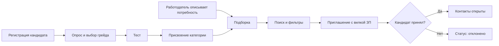

# Минимальный набор экранов по ТЗ

> Платформа-агрегатор ИТ-вакансий с верифицированным профилем достижений участника ФСП.

**Обозначения ссылок на ТЗ:**

| Обозначение | Раздел ТЗ |
|---|---|
| **п.2** | Описание задачи |
| **2.1** | Функциональные требования |
| **2.2** | Данные и правила видимости |
| **3.3** | Требования к демонстрации |
| **3.5** | Нефункциональные требования |
| **п.6** | Критерии оценки |

## Содержание

1. [Общие экраны](#общие-экраны)
2. [Кабинет «Кандидат»](#кабинет-кандидат)
3. [Кабинет «Работодатель»](#кабинет-работодатель)
4. [Необязательные экраны](#необязательные-экраны)
5. [Сквозной сценарий для демо](#сквозной-сценарий-для-демо)
6. [Сводная таблица](#сводная-таблица)

---

## Общие экраны

### 1. Регистрация / вход

| Элемент | Зачем | Где в ТЗ |
|---|---|---|
| Email + пароль | Регистрация только по почте | 2.2, п.4 |
| Выбор роли (кандидат / работодатель) | Два раздельных кабинета | 2.1 |
| Чекбокс согласия на обработку данных | 152-ФЗ, согласие на обработку и публикацию | 3.5 «Безопасность»; 2.1 «Настройки» |

### 2. Подтверждение email

| Элемент | Зачем | Где в ТЗ |
|---|---|---|
| Ввод кода или переход по ссылке | Регистрация «с подтверждением адреса» | 2.2, п.4 |

---

## Кабинет «Кандидат»

### 3. Профиль / резюме

| Элемент | Зачем | Где в ТЗ |
|---|---|---|
| Форма: ФИО, контакты, стек, грейд, роли, стаж, софт-скиллы | Состав полей профиля | 2.1 «Заполнение профиля» |
| Кнопка «Скачать PDF-профиль» | Автогенерация стандартизированного PDF | 2.1 |
| Загрузка PDF с автораспознаванием | Часть того же пункта, на оценку напрямую не влияет, можно сделать вторым шагом | 2.1 |
| Подпись «не влияет на категорию» | Категория определяется тестом, а не самоописанным резюме | п.2; 2.1 «Выдача формируется…» |

### 4. Опрос: отрасль, специализация, грейд

| Элемент | Зачем | Где в ТЗ |
|---|---|---|
| Выбор отрасли и специализации из справочника | Обязательный путь при регистрации | п.2 |
| Самостоятельный выбор предполагаемого грейда | Определяет, на какой уровень будет тест | п.2 |
| Справочник из основных направлений | На MVP достаточно основных направлений | п.2 |

### 5. Экран тестирования

| Элемент | Зачем | Где в ТЗ |
|---|---|---|
| Задания, таймер, поле ответа, кнопка «Завершить» | Работающая механика тестирования | п.2 |
| Задания из шаблонов или пула, а не единый набор | Устойчивость к распространению заданий | п.2; п.6.2 |
| Разные варианты у разных кандидатов (показать в демо) | Нужно отдельно показать механику тестирования | 3.3 |

### 6. Результат теста и присвоенная категория

| Элемент | Зачем | Где в ТЗ |
|---|---|---|
| Итог теста и категория вида «Backend, Middle» | Результат автоматически определяет категорию, видимую работодателю | 2.1 «Прохождение тестирования» |
| Краткое объяснение результата | Прозрачность оценки | п.6.2 |
| Предложение пройти тест уровнем ниже при провале | Грейд не понижается принудительно | п.2 |

### 7. Категория и грейд (статус)

| Элемент | Зачем | Где в ТЗ |
|---|---|---|
| Текущие специализация и грейд | Текущий статус | 2.1 «Категория и грейд» |
| История опроса и тестов | То же | 2.1 |
| Кнопки «Пройти тест выше / ниже» | Повышение и понижение грейда по желанию кандидата | п.2; 2.1 |
| Блокировка кнопок с датой, когда смена станет доступна | Лимит смены грейда, например раз в 3 месяца | п.2; 2.1 |

### 8. Входящие приглашения (список + деталь)

| Элемент | Зачем | Где в ТЗ |
|---|---|---|
| Список со статусами: отправлено, просмотрено, принято, отклонено | Статусная модель, обе стороны видят актуальный статус | 2.2, п.3 |
| Компания, описание предложения, способ связи | Обязательное содержимое приглашения | 2.2, п.2 |
| **Вилка зарплаты «от–до» в рублях** | Кандидат видит условия до начала общения, это «принципиальное отличие» от других площадок | 2.2, п.1 |
| Кнопки «Принять» / «Отклонить» | Действия кандидата | 2.1 |
| Открытие детали переводит статус в «просмотрено» | Корректная работа статусов | 2.2, п.3 |

### 9. Настройки

| Элемент | Зачем | Где в ТЗ |
|---|---|---|
| Переключатели приватности (что видно работодателю) | Управление видимостью профиля | 2.1 «Настройки» |
| Согласия на обработку и публикацию данных | Требование безопасности | 2.1; 3.5 |
| Блок «Связать с ФСП ID» | Профиль должен иметь возможность связи с ID участника ФСП (вход через Keycloak можно имитировать) | п.2 |
| Состояние «ФСП не привязан» с нейтральным текстом и кнопкой привязки | **Обязательный** кейс: корректная обработка отсутствия истории ФСП | п.2; п.6.5 |

---

## Кабинет «Работодатель»

### 10. Профиль компании

| Элемент | Зачем | Где в ТЗ |
|---|---|---|
| Описание организации, направление деятельности, контакты | Содержимое профиля компании | 2.1 |
| Название и способ связи | Подставляются в приглашение | 2.2, п.2 |

### 11. Описание потребности

| Элемент | Зачем | Где в ТЗ |
|---|---|---|
| Какие специалисты нужны, чем занимается команда | Входные данные для подборки | 2.1 |
| Стек, специализация, грейд | На их основе формируется подборка | 2.1 |

### 12. Подборка (рекомендации)

| Элемент | Зачем | Где в ТЗ |
|---|---|---|
| Блок «Рекомендованные категории» и кандидаты внутри | Работа с подборкой | 2.1 «Работа с подборкой» |
| Строка «Почему в подборке» (например: стек совпал на 4 из 5, тест 87%, есть участие в ФСП) | Объяснимость выдачи | 2.1; п.6.1 |
| Порядок внутри категории: результат теста, затем достижения ФСП | Ранжирование по силе подтверждённого профиля | 2.1 «Функциональные требования к поиску» |

### 13. Банк кандидатов (поиск)

| Элемент | Зачем | Где в ТЗ |
|---|---|---|
| Фильтры: специализация, грейд, категория, стек, наличие достижений ФСП | Все пять фильтров названы явно | 2.1 |
| Уточнение запроса без сброса подборки | Требование к поиску | 2.1, последний пункт раздела «поиск и подбор» |
| Выдача строится по категориям, а не по тексту резюме | Основа механики | 2.1 |

### 14. Карточка кандидата

| Элемент | Зачем | Где в ТЗ |
|---|---|---|
| Категория, результат теста, стек | Подтверждённый профиль | 2.1 |
| Блок достижений ФСП с заглушкой, если истории нет | Обязательная обработка случая без ФСП | п.2; п.6.5 |
| Кнопка «Пригласить» | Переход к главному сценарию | 2.1 «Выход на контакт» |
| **Контактов нет** (лучше показывать анонимный ID вместо ФИО) | Контакты скрыты до принятия приглашения | 2.1 «Ограничение доступа»; 2.2, п.2 |
| Скрытые пользователем поля не отображаются | Настройки приватности | 2.1 |

### 15. Форма приглашения

| Элемент | Зачем | Где в ТЗ |
|---|---|---|
| Описание предложения | Обязательное содержимое приглашения | 2.2, п.2 |
| **Зарплата «от» и «до», обязательные, в ₽** | Обязательное условие | 2.2, п.1 |
| Название компании (подставляется) и способ связи | Обязательное содержимое приглашения | 2.2, п.2 |
| Необязательное поле «Вакансия» | Приглашение «без обязательной привязки к вакансии» | 2.1 |

### 16. Мои приглашения (статусы)

| Элемент | Зачем | Где в ТЗ |
|---|---|---|
| Таблица: кандидат, дата, вилка, статус | Отслеживание статусов приглашений | 2.1; 2.2, п.3 |
| Контакты кандидата открываются после статуса «принято» | Правило видимости (показать в демо) | 2.2, п.2; 2.1 |

---

## Необязательные экраны

Дают до **+7%** по критерию п.6.6. Делать только после того, как основной сценарий работает целиком.

- [ ] Список вакансий и мои отклики (кандидат)
- [ ] Публикация вакансий и входящие отклики (работодатель)
- [ ] Регулярные короткие задания (кандидат)
- [ ] Мобильная адаптивная вёрстка

---

## Сквозной сценарий для демо

Требование п.3.3: показать путь целиком, а также отдельно объяснить механику тестирования и подбора.

---

## Сводная таблица

| № | Экран | Роль | Приоритет |
|---|---|---|---|
| 1 | Регистрация / вход | Общий | Обязательно |
| 2 | Подтверждение email | Общий | Обязательно |
| 3 | Профиль / резюме | Кандидат | Обязательно |
| 4 | Опрос | Кандидат | Обязательно |
| 5 | Тестирование | Кандидат | Обязательно (25%) |
| 6 | Результат и категория | Кандидат | Обязательно (25%) |
| 7 | Категория и грейд | Кандидат | Обязательно |
| 8 | Входящие приглашения | Кандидат | Обязательно (35%) |
| 9 | Настройки | Кандидат | Обязательно |
| 10 | Профиль компании | Работодатель | Обязательно |
| 11 | Описание потребности | Работодатель | Обязательно |
| 12 | Подборка | Работодатель | Обязательно (35%) |
| 13 | Банк кандидатов | Работодатель | Обязательно |
| 14 | Карточка кандидата | Работодатель | Обязательно |
| 15 | Форма приглашения | Работодатель | Обязательно (35%) |
| 16 | Мои приглашения | Работодатель | Обязательно |
